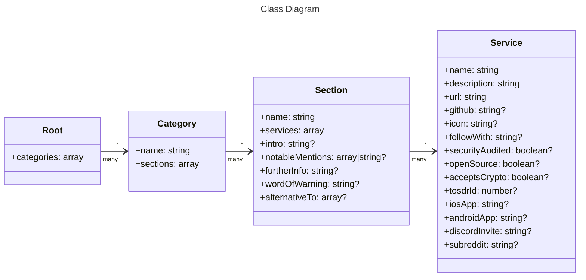

# Contributing


- [How to make an Addition](#how-to-make-an-addition)
- [Requirements](#requirements)
- [Guidelines](#guidelines)
- [Editing the YAML](#editing-the-yaml)
  - [Top-Level Structure](#top-level-structure)
  - [Service Fields](#service-fields)
  - [Example](#example)
  - [Validating your Entry](#validating-your-entry)
  - [Need Help?](#need-help)
- [Thank You](#thank-you)

---

## How to make an Addition

You can add, edit or remove entries by opening a pull request.

All data is stored in [`awesome-privacy.yml`](https://github.com/Lissy93/awesome-privacy/blob/main/awesome-privacy.yml).
If you're adding, editing or removing a listing - **this is the only file you need to edit**.

### Process

Get started by forking the repo, [editing](https://github.com/Lissy93/awesome-privacy/edit/main/awesome-privacy.yml) the data, committing changes to your fork, and opening a pull request upstream to this repo's main branch. If you're new to open source, you can find some resources to get you started at [git-in.to](https://git-in.to), but feel free to reach out if you need any help 😊 

Your request will be reviewed, then either merged, or have changes requested, or if the [Guidelines](#guidelines) are not met, it may be closed with a comment explaining why.

### Other Changes

- To make layout or stylistic edits to the site ([awesome-privacy.xyz](https://awesome-privacy.xyz)), see the [Website docs](https://github.com/Lissy93/awesome-privacy#the-website) in the readme for build and running instructions.
- To make edits to the API ([api.awesome-privacy.xyz](http://api.awesome-privacy.xyz/)), see the [API docs](https://github.com/Lissy93/awesome-privacy#the-api) in the readme for build and running instructions.

---

## Requirements

For software to be included in this list, it must meet the following requirements: 

- **Privacy Respecting**
	- The project must respect users privacy, not collect more data than necessary, and store info securely
	- For hosted services, the project must have a clear privacy policy
	- The user must remain in full control of their data, and be able to delete it at any time
- **Secure**
  - The software must be secure by default, without requiring additional configuration
  - There should be no current, critical security issues
  - The handling of past issues must have been prompt, transparent and effective
- **Open Source**
	- The full source code should be released under an open source license
	- Ideally it should be possible for the user to build and run/deploy the software themselves from source
- **Actively Maintained**
  - The developers should address dependency updates and security patches in a timely manner
- **Transparent**
  - It should be clear who is behind the project, what their motives are, and what (if any) the funding model is
- **Ethical**
  - Must not suppress free speech, discriminate or disregard any human rights
- **Relevant**
	- The software must be relevant, and fit into one of the existing categories
- **Functional**
	- Must be fully functional, and not just a concept or idea
	- A stable (non-alpha/beta) release is required at a minimum
	- Must be accessible to the general public, and not just a select group of people
	- If technical knowledge is required to run it, the software must be well documented

_There may be some exceptions, but these would need to be fully justified, reviewed
by the community, and the drawbacks / anti-features must be clearly listed along-side the software.
Usually these entries go within the "Notable Mentions" section instead._

---


## Guidelines

Your pull request must follow these requirements. Failure to do so, might result in it being closed.

- Do not edit the README directly when adding / editing a listing
- Ensure your PR is not a duplicate, search for existing / previous submissions first
- You must respond to any comments or requests for changes in a timely manner, 48-hours maximum
- Write short but descriptive git commit messages, under 50 characters. This must be in the format of `Adds [software-name] to [section-name]`. Your PR will be rejected if you name it `Updates README.md`
- Only include a single addition / amendment / removal, per pull request
- If your pull request contains multiple commits, you must squash them first
- You must complete each of the sections in the pull request template. Do not delete it!
- Where applicable, include links to supporting material for your addition: git repo, docs, recent security audits, etc. This will make researching it much easier for reviewers
- While adding new software to the list, don't make your entry read like an advert. Be objective, and include drawbacks as well as strengths
- Your entry should be added at the bottom of the appropriate category, unless otherwise requested
- If there are other pull requests open, please help review them before submitting yours
- A pull request must receive multiple approval reviews before it can be merged
- You must be transparent about your affiliation with a product or service that you are adding. It's totally okay to submit your own projects as additions (providing they meet the requirements), but if you don't declare your association with that project then there becomes a clear conflict of interest
- You must adhere to the Contributor Covenant Code of Conduct
- Don't open a Draft / WIP pull request while you work on the guidelines. A pull request should be 100% ready and should adhere to all the above guidelines when you open it
- Your changes must be correctly spelled, and with good grammar
- Your changes must be correctly formatted, in valid markdown
- The addition title must be a link the project, and in bold
- The addition description must be no less than 50, and no more than 250 characters, keep it clear and to the point

---

## Editing the YAML

All content in both the README and website is generated using the data in [`awesome-privacy.yml`](https://github.com/Lissy93/awesome-privacy/blob/main/awesome-privacy.yml).
This file may look a bit daunting to start with, but don't worry - it's pretty simple.

### Top-Level Structure




At a high-level, the file exports an array of categories, each containing a `name` and array of `sections`.


```yaml
categories:
  - name: Essentials
    sections: []
- name: Communication
    sections: []
 - name: Security Tools
    sections: []
```

Each category contains a `name` an array of `sections` (like sub-categories)

```yaml
 - name: Communication
   sections:
   - name: Encrypted Messaging
     services: []
   - name: P2P Messaging
     intro: ...
     services: []
   - name: Encrypted Email
     services: []
   - name: Email Clients
     services: []
```

And within each section, we find a list of `services`, each containing a listing. For example:

```yaml
services:
- name: Addy
  url: https://addy.io
  icon: https://addy.io/apple-touch-icon.png
  github: anonaddy/anonaddy
  tosdrId: 2220
  description: |
    An open source anonymous email forwarding service, allowing you to create unlimited
    email aliases which forward to one or more of your private email addresses.

- name: Firefox Private Relay
  url: https://relay.firefox.com
  icon: https://relay.firefox.com/favicon.svg
  openSource: true
  github: mozilla/fx-private-relay
  tosdrId: 4158
  description: |
    Developed and managed by Mozilla, Relay is a Firefox addon, that lets you make an
    email alias with 1 click, and have all messages forwarded onto your personal email.
```


### Service Fields

Each service (aka an app/website/software) has the following fields:

| Attribute         | Description                                                                                                  | Type     | Required |
|-------------------|--------------------------------------------------------------------------------------------------------------|----------|----------|
| `name`            | The name of the listing                                                                                      | `string` | Required |
| `description`     | A short and subjective description of the listing. Markdown is supported. Split longer descriptions onto multiple lines | `string` | Required |
| `url`             | The fully qualified domain name of the listing's homepage                                                    | `string` | Required |
| `icon`            | A path to an icon file for the listing's logo. Must be square, no less than 64x64 and no larger than 512x512 pixels | `string` | Required |
| `github`          | The GitHub repository hosting the listing's source code. In the format of `[owner]/[repo]`                   | `string` | Optional |
| `securityAudited` | Has the listing been audited by an accredited security researcher, with the report publicly published?       | `bool`   | Optional |
| `acceptsCrypto`   | If payment is required/accepted, do they accept anonymous payments using cryptocurrency, such as Monero?     | `bool`   | Optional |
| `openSource`      | Is the source code in its entirety published somewhere accessible so it can be built-from-source or self-hosted? | `bool`   | Optional |
| `tosdrId`         | If the privacy policy has been analysed by ToS;DR, include the ID to their report                             | `number` | Optional |
| `iosApp`          | URL to the listing's mobile app on the Apple App Store                                                       | `string` | Optional |
| `androidApp`      | URL to the listing's mobile app on the Google Play Store                                                     | `string` | Optional |
| `discordInvite`   | The invite code to the Discord server for this service                                                       | `string` | Optional |
| `subreddit`       | Name of the subreddit for this service, without `r/` or the full URL                                         | `string` | Optional |


> [!NOTE]
> Anything which is marked as `optional`, and which doesn't apply to your service can just be left out.<br>
> Keep max line length around 80-100 chars. If the description is long, split it onto multiple lines, using YAML multi-line string (like `: |`).

### Example

https://github.com/Lissy93/awesome-privacy/blob/912bff8a34e6195ad7b03bc1be978ccd559ed42a/awesome-privacy.yml#L39-L52

### Validating your Entry
Once you've finished editing the YAML file, you may run `make validate` to run [`validate-awesome-privacy.py`](https://github.com/Lissy93/awesome-privacy/blob/main/lib/validate-awesome-privacy.py), which will ensure your [`awesome-privacy.yml`](https://github.com/Lissy93/awesome-privacy/blob/main/awesome-privacy.yml) is both valid and fits within our defined schema (in [`lib/schema.json`](https://github.com/Lissy93/awesome-privacy/blob/main/lib/schema.json))

### Need Help?
Just look at some of the existing entries in the file for inspiration, and if you're still stuck, feel free to reach out for help. We're here to help you get your contribution merged!

---

## Thank You

Thank you for helping keep Awesome Privacy up-to-date! It's thanks to contributors like you that this project is possible.


