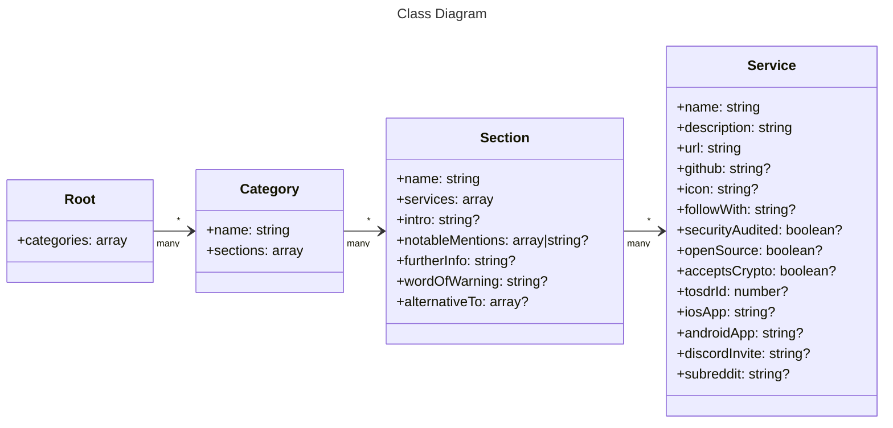

# Contributing


- [How to make an Addition](#how-to-make-an-addition)
- [Requirements](#requirements)
- [Guidelines](#guidelines)
- [Editing the YAML](#editing-the-yaml)
  - [Top-Level Structure](#top-level-structure)
  - [Service Fields](#service-fields)
  - [Example](#example)
  - [Validating your Entry](#validating-your-entry)
  - [Need Help?](#need-help)
- [Thank You](#thank-you)

---

## How to make an Addition

You can add, edit or remove entries by opening a pull request.

All data is stored in [`awesome-privacy.yml`](https://github.com/Lissy93/awesome-privacy/blob/main/awesome-privacy.yml).
If you're adding, editing or removing a listing - **this is the only file you need to edit**. Don't edit the README directly, as this is auto-generated from the YAML file.

### Process

Get started by forking the repo, [editing](https://github.com/Lissy93/awesome-privacy/edit/main/awesome-privacy.yml) the data, committing changes to your fork, and opening a pull request upstream to this repo's main branch. If you're new to open source, you can find some resources to get you started at [git-in.to](https://git-in.to), but feel free to reach out if you need any help 😊 

Your request will be reviewed, then either merged, or have changes requested, or if the [Guidelines](#guidelines) are not met, it may be closed with a comment explaining why.

### Other Changes

- To make layout or stylistic edits to the site ([awesome-privacy.xyz](https://awesome-privacy.xyz)), see the [Website docs](https://github.com/Lissy93/awesome-privacy#the-website) in the readme for build and running instructions.
- To make edits to the API ([api.awesome-privacy.xyz](http://api.awesome-privacy.xyz/)), see the [API docs](https://github.com/Lissy93/awesome-privacy#the-api) in the readme for build and running instructions.
- To make changes to the automations (which validate, process and insert the data), see the [lib](https://github.com/Lissy93/awesome-privacy/blob/main/lib) directory

---

## Requirements

For software to be included in this list, it must meet the following requirements: 

- **Privacy Respecting**
	- The project must respect users privacy, not collect more data than necessary, and store info securely
	- For hosted services, the project must have a clear privacy policy
	- The user must remain in full control of their data, and be able to export and delete it at any time
- **Secure**
  - The software must be secure by default, without requiring additional configuration
  - There should be no current, critical security issues
  - The handling of past issues must have been prompt, transparent and effective
- **Open Source**
	- The full source code should be released under an open source license
	- Ideally it should be possible for the user to build and run/deploy the software themselves from source
- **Actively Maintained**
  - The project must not be abandoned or severely out-dated 
  - The developers should address dependency updates and security patches in a timely manner
- **Transparent**
  - It should be clear who is behind the project, what their motives are, and what (if any) the funding model is
- **Ethical**
  - Must not suppress free speech, discriminate or disregard any human rights
- **Relevant**
	- The software must be relevant, and fit into one of the existing categories
- **Functional**
	- Must be fully functional, and not just a concept or idea
	- A stable (non-alpha/beta) release is required at a minimum
	- Must be accessible to the general public, and not just a select group of people
	- If technical knowledge is required to run it, the software must be well documented
- **Mature**
  - Software needs to have a proven track record of commitment to maintenance
  - Repositories must not be newly created, and the first stable release older than 4 months
  - Projects that are largely AI/autogenerated without meaningful review or maintainership are not suitable for listing here

_There may be some exceptions, but these would need to be fully justified, reviewed
by the community, and the drawbacks / anti-features must be clearly listed along-side the software.
Usually these entries go within the "Notable Mentions" section instead._

---


## Guidelines

Your pull request must follow these requirements. Failure to do so, might result in it being closed.

- Do not edit the README directly when adding / editing a listing (it's auto-generated!)
- Ensure your PR is not a duplicate, search for existing / previous submissions first
- Don't forget to give the PR a title. Use the format of `Adds [software-name] to [section-name]`
- Only include a single addition / amendment / removal, per pull request
- You must complete each of the sections in the [pull request template](https://github.com/Lissy93/awesome-privacy/blob/main/.github/PULL_REQUEST_TEMPLATE.md). Do not delete it!
- Where applicable, include links to supporting material for your addition: git repo, docs, recent security audits, etc. This will make researching it much easier for reviewers
- Your entry should be added at the bottom of the appropriate category
- Your changes must be correctly formatted, in valid yaml and which conforms to the schema
- Description needs to be 50-250 characters, and must not read like an advert. Be objective, and include drawbacks as well as strengths
- You must be transparent about your affiliation with a product or service that you are adding. It's totally okay to submit your own projects, but if you don't declare your association with that project then there becomes a clear conflict of interest
- You must respond to any comments or requests for changes in a timely manner, 14 days maximum
- You must adhere to the [Contributor Covenant Code of Conduct](https://github.com/Lissy93/awesome-privacy?tab=coc-ov-file#contributor-covenant-code-of-conduct)

---

## Editing the YAML

All content in both the README and website is generated using the data in [`awesome-privacy.yml`](https://github.com/Lissy93/awesome-privacy/blob/main/awesome-privacy.yml).
This file may look a bit daunting to start with, but don't worry - it's pretty simple.

### Top-Level Structure


```mermaid
---
title: Class Diagram
---

classDiagram
    direction LR
    class Root {
        +categories: array
    }
    class Category {
        +name: string
        +sections: array
    }
    class Section {
        +name: string
        +services: array
        +intro: string?
        +notableMentions: array|string?
        +furtherInfo: string?
        +wordOfWarning: string?
        +alternativeTo: array?
    }
    class Service {
        +name: string
        +description: string
        +url: string
        +github: string?
        +icon: string?
        +followWith: string?
        +securityAudited: boolean?
        +openSource: boolean?
        +acceptsCrypto: boolean?
        +tosdrId: number?
        +iosApp: string?
        +androidApp: string?
        +discordInvite: string?
        +subreddit: string?
    }

    Root "many" --> "*" Category
    Category "many" --> "*" Section
    Section "many" --> "*" Service

```

At a high-level, the file exports an array of categories, each containing a `name` and array of `sections`.


```yaml
categories:
  - name: Essentials
    sections: []
- name: Communication
    sections: []
 - name: Security Tools
    sections: []
```

Each category contains a `name` an array of `sections` (like sub-categories)

```yaml
 - name: Communication
   sections:
   - name: Encrypted Messaging
     services: []
   - name: P2P Messaging
     intro: ...
     services: []
   - name: Encrypted Email
     services: []
   - name: Email Clients
     services: []
```

And within each section, we find a list of `services`, each containing a listing. For example:

```yaml
services:
- name: Addy
  url: https://addy.io
  icon: https://addy.io/apple-touch-icon.png
  github: anonaddy/anonaddy
  tosdrId: 2220
  description: |
    An open source anonymous email forwarding service, allowing you to create unlimited
    email aliases which forward to one or more of your private email addresses.

- name: Firefox Private Relay
  url: https://relay.firefox.com
  icon: https://relay.firefox.com/favicon.svg
  openSource: true
  github: mozilla/fx-private-relay
  tosdrId: 4158
  description: |
    Developed and managed by Mozilla, Relay is a Firefox addon, that lets you make an
    email alias with 1 click, and have all messages forwarded onto your personal email.
```


### Service Fields

Each service (aka an app/website/software) has the following fields:

| Attribute         | Description                                                                                                  | Type     | Required |
|-------------------|--------------------------------------------------------------------------------------------------------------|----------|----------|
| `name`            | The name of the listing                                                                                      | `string` | Required |
| `description`     | A short and subjective description of the listing. Markdown is supported. Split longer descriptions onto multiple lines | `string` | Required |
| `url`             | The fully qualified domain name of the listing's homepage                                                    | `string` | Required |
| `icon`            | A path to an icon file for the listing's logo. Must be square, no less than 64x64 and no larger than 512x512 pixels | `string` | Required |
| `github`          | The GitHub repository hosting the listing's source code. In the format of `[owner]/[repo]`                   | `string` | Optional |
| `securityAudited` | Has the listing been audited by an accredited security researcher, with the report publicly published?       | `bool`   | Optional |
| `acceptsCrypto`   | If payment is required/accepted, do they accept anonymous payments using cryptocurrency, such as Monero?     | `bool`   | Optional |
| `openSource`      | Is the source code in its entirety published somewhere accessible so it can be built-from-source or self-hosted? | `bool`   | Optional |
| `tosdrId`         | If the privacy policy has been analysed by ToS;DR, include the ID to their report                             | `number` | Optional |
| `iosApp`          | URL to the listing's mobile app on the Apple App Store                                                       | `string` | Optional |
| `androidApp`      | URL to the listing's mobile app on the Google Play Store                                                     | `string` | Optional |
| `discordInvite`   | The invite code to the Discord server for this service                                                       | `string` | Optional |
| `subreddit`       | Name of the subreddit for this service, without `r/` or the full URL                                         | `string` | Optional |


> [!NOTE]
> Anything which is marked as `optional`, and which doesn't apply to your service can just be left out.<br>
> Keep max line length around 80-100 chars. If the description is long, split it onto multiple lines, using YAML multi-line string (like `: |`).

### Example

https://github.com/Lissy93/awesome-privacy/blob/912bff8a34e6195ad7b03bc1be978ccd559ed42a/awesome-privacy.yml#L39-L52

### Validating your Entry
Once you've finished editing the YAML file, you may run `make validate` to run [`validate-awesome-privacy.py`](https://github.com/Lissy93/awesome-privacy/blob/main/lib/validate-awesome-privacy.py), which will ensure your [`awesome-privacy.yml`](https://github.com/Lissy93/awesome-privacy/blob/main/awesome-privacy.yml) is both valid and fits within our defined schema (in [`lib/schema.json`](https://github.com/Lissy93/awesome-privacy/blob/main/lib/schema.json))

### Need Help?
Just look at some of the existing entries in the file for inspiration, and if you're still stuck, feel free to reach out for help. We're here to help you get your contribution merged!

---


## About the Automated Pre-Review

When you open a PR, we run a few automated checks. This was implemented so that you get helpful feedback immediately, if the submission contains a common mistake.
Note that the pass/fail of these checks does not indicate whether a PR will or will not be merged. And if something does fail, my friendly bot will drop a comment explaining how you can fix it :)

<details>
	<summary>View all checks</summary>

Below is the full list of checks - it's basically the same as what is listed in the [Contributing Guidelines](https://github.com/Lissy93/awesome-privacy/blob/main/.github/CONTRIBUTING.md#guidelines) above. Everything in red needs to pass to be merged, whereas yellow is just warnings/suggestions.

- **PR Meta**
	- 🔴 **Title format** - Must follow `[Add/Remove/Update] [name] in [section]`
	- 🔴 **Template filled** - All required sections (Type, Changes, Checklist) must be present
	- 🔴 **Checkboxes ticked** - All checklist boxes must be checked with `[x]`
	- 🔴 **No README edits** - README is auto-generated, so direct edits are rejected
	- 🟡 **Not a draft** - WIP/draft PRs are discouraged
	- 🟡 **No bot authors** - Commits should not be solely authored by an AI bot
- **Validating Addition**
	- 🔴 **Schema valid** - YAML must pass schema validation
	- 🔴 **Required fields** - Must include `name`, `description`, `url`, `icon`
	- 🟡 **Single entry** - Only one service addition per PR
	- 🟡 **Position** - New entries must go at the end of their section
	- 🟡 **Open source** - Non-open-source submissions need justification
	- 🟡 **Duplicate name** - Service name must not already exist
	- 🟡 **Duplicate URL** - Service URL must not already exist
	- 🟡 **Description length** - Should be 50–250 characters
	- 🟡 **Open source + GitHub** - If marked open source, must include `github` field
- **Project Health**
	- 🟡 **Links reachable** - Service URL and icon must not return 404
	- 🟡 **Author disclosure** - If PR author owns the repo, they should disclose it
	- 🟡 **Not inactive** - Repo should have a push within the last 90 days
	- 🟡 **Minimum age** - Repo should be ≥4 months old
	- 🟡 **AI-generated code** - Flags if ≥20% of recent code came from an AI bot
	- 🟡 **Not a fork** - Flags if the GitHub link is a fork instead of source
	- 🟡 **Has license** - Repo should include a license
	- 🟡 **Not archived** - Repo must not be archived
	- 🟡 **No security alerts** - No open critical/high Dependabot alerts
	- 🟡 **Minimum stars** - Repo should have ≥100 stars
	- 🟡 **Spam detection** - Flags if user opened ≥5 PRs to other awesome-* repos in 24h
- **Addition Info** (fyi only, no pass/fail requirements or warnings)
	- 🔵 **Website check** (if has `website`) - Quickly checks for basic security requirements for website
	- 🔵 **Source check**  (if has `github`) - Brief audit of core GitHub metrics from submitted the repo
	- 🔵 **Android check**  (if has `android`) - Lists the trackers, permissions and stats for the Android app
	- 🔵 **iOS check**  (if has `ios`) - Shows average rating, and app stats from the Apple App Store
	- 🔵 **Privacy Policy check**  (if has `tosdr`) - Outputs the privacy score from ToS;DR and links to policy
 
</details>

---

## Thank You

Thank you for helping keep Awesome Privacy up-to-date! It's thanks to contributors like you that this project is possible.


